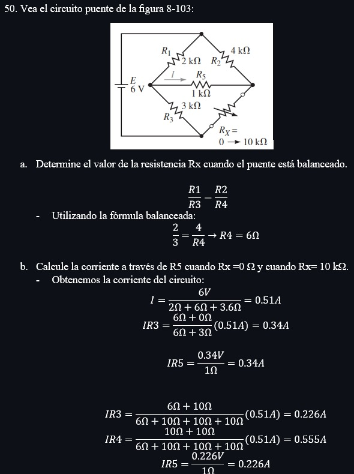

# InformeTarea4

1. OBJETIVOS

☻ Generales:

* Ser capaces de reconocer los diferentes tipos de Circuitos en serie-paralelo a profundidad de los conceptos fundamentales.

* Conocer los métodos de análisis, Fuentes de corriente en paralelo y en serie a través del análisis de corriente de ramas.

☻Específicos:

* Analizar y calcular los ejercicios del capitulo 7 y 8 con lo conocimientos adquiridos en clase. 

* Demostrar los distintos métodos de resolución de circuitos.

* Analizar el circuito para encontrar sus elementos y entender su función.

* Reforzar los conocimientos establecidos en clase por medio de la resolución de ejercicios.

2. Marco Teorico 

3. EXPLICACIÓN Y RESOLUCIÓN DE EJERCICIOS O PROBLEMAS

UNIDAD 7

UNIDAD 8

4. VDEO:

https://youtu.be/xkvO57nwO18 

6. CONCLUSIONES

*Tras resolver y conocer los diferentes tipos de Circuitos en serie-paralelo somos capaces de aplicarlos sobre circuitos eléctricos.

*Ahora que conocemos los métodos de análisis, Fuentes de corriente en paralelo y en serie podemos resolver problemas de circuitos eléctricos con el análisis de ramas, nodos, mallas facilitándonos los cálculos.  

* En relacion a lo expuesto podemos concluir que estamos preparados para realizar ,analizar y resolver ejercicios que se nos presentaron en estos capitulos

8. BIBLIOGRAFÍA

