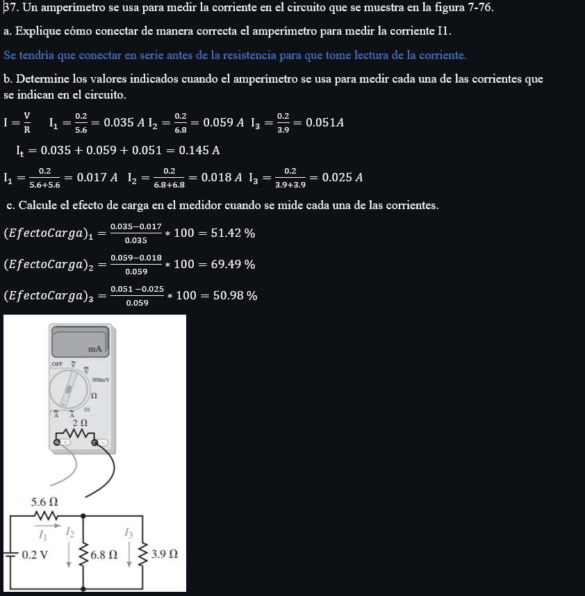

# InformeTarea4

1. OBJETIVOS

☻ Generales:
* Analizar y calcular con lo conocimientos adquiridos en clases los ejercicios del capitulo 7 y 8 

☻Específicos:
* 

2. Marco Teorico 

3. EXPLICACIÓN Y RESOLUCIÓN DE EJERCICIOS O PROBLEMAS

UNIDAD 7

UNIDAD 8

4. VDEO:

6. CONCLUSIONES

8. BIBLIOGRAFÍA

